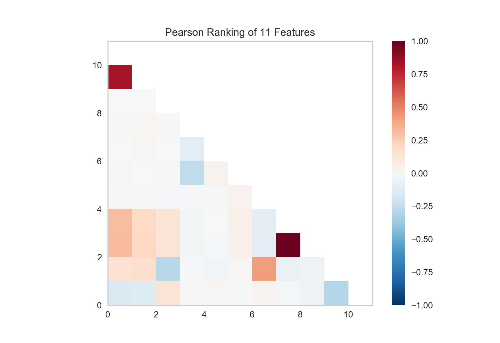
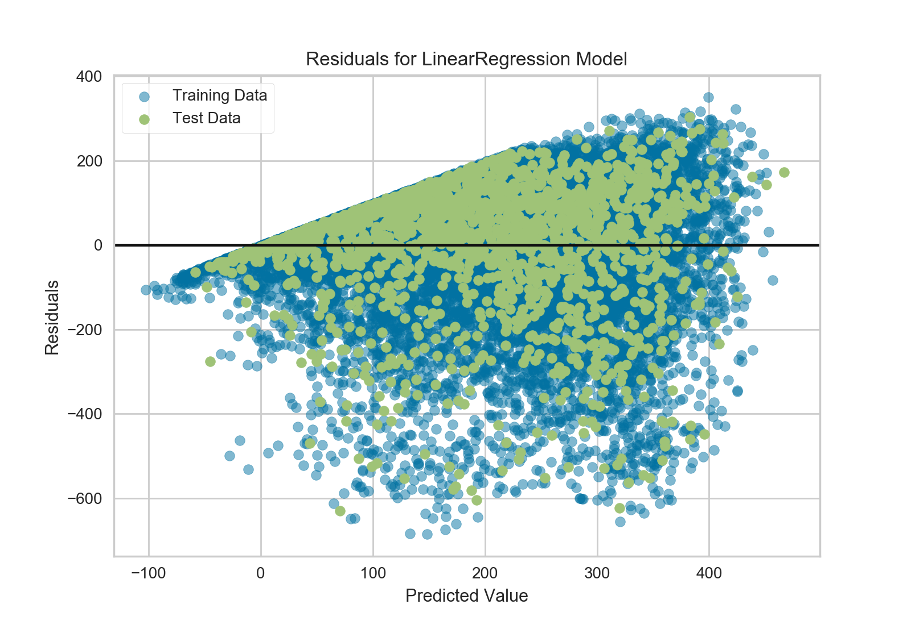
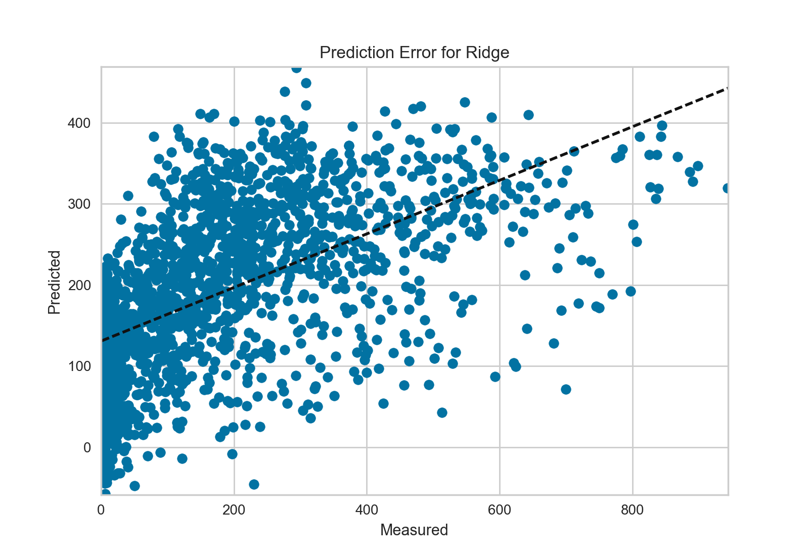

.. -*- mode: rst -*-

快速开始
===========

如果你对Yellowbrick还不熟悉, 这个教程可以帮助你很快上手将可视化运用到你机器学习的流程中去。不过在我们开始用Yellowbrick之前，有几个开发环境相关的问题需要注意。

Yellowbrick主要依赖于两个包: `Scikit-Learn <http://scikit-learn.org/>`_ 和 `Matplotlib <http://matplotlib.org/>`_.如果你没有安装这两个包也没关系，当你安装Yellowbrick的时候，它会帮你将它们一起装上。需要注意的是，要想Yellowbrick达到最佳效果，最好是结合Scikit-Learn 0.18和Matplotlib 2.0及以上版本使用。因为上述两个包都通过C语言编译，在某些系统上（比如Windows）安装时可能会有一些困难。如果你安装有困难，可以使用`Anaconda <https://anaconda.org>`_等其他版本Python。

.. 注意:: Jupyter，Pandas，还有其他辅助库，比如文字可视化库（NLTK）是没有和Yellowbrick一起安装的，必须单独安装.

安装
------------

Yellowbrick虽然和Python 2.7及以后版本也兼容，但是如果你想更好得利用其全部功能，建议其与和Python 3.5及以后版本一起使用。安装Yellowbrick最简单的方法是从PyPI_用pip_（Python包安装的首选安装程序）安装。
.. code-block:: bash

    $ pip install yellowbrick

.. _PyPI: https://pypi.python.org/pypi/yellowbrick
.. _pip: https://docs.python.org/3/installing/

需要注意的是Yellowbrick是一个在建的项目，目前常规发布新的版本，并且每一个新版本都将会有新的可视化功能更新。为了将Yellowbrick升级到最新版本，你可以用如下pip命令.

.. code-block:: bash

    $ pip install -u yellowbrick

你也可以用``-u``标记对Scikit-Learn，matplotlib或者其他和Yellowbrick兼容的第三方包进行升级.

如果你使用的是Windows或者Anaconda，你也可以充分利用`conda <https://conda.io/docs/intro.html>`_的功能安装`Anaconda Yellowbrick package <https://anaconda.org/DistrictDataLabs/yellowbrick>`_:

.. code-block:: bash

    conda install -c districtdatalabs yellowbrick

.. 警告:: 在Linux上用Anaconda安装matplotlib时有一个`漏洞 <https://github.com/DistrictDataLabs/yellowbrick/issues/205>`_。如果你有任何问题，请在GitHub知会我们.

一旦安装好，不管你是在Python内部还是在Jupyter notebooks上运行Yellowbrick应该就没问题了。需要注意的是，因为Yellowbrick用的是matplotlib，其并不能在虚拟环境中运行。如果你一定要用的话，可能需要费一些周折。

使用Yellowbrick
-----------------
为了更好得配合Scikit-Learn一起使用，我们特意对Yellowbrick API进行了一些特殊设计。当然其最主要的接口就是“Visualizer” —— 一个可以运用数据产生图片的对象。visualizer是一系列Scikit-Learn的`Estimator <http://scikit-learn.org/stable/developers/contributing.html#apis-of-scikit-learn-objects>`_对象并且和画图的方法有很多接口。和用Scikit-Learn建模相同的流程相同，用visualizer也需要先将其载入，对其初始化，调用其``fit()``方法，然后调用其``poof()``方法 —— 然后就是见证奇迹的那一刻了。

比如，有很多visualizer可以作为转换器来使用，用于在模型拟合之前对特征进行分析。下面这个例子展示的就是如何用平行坐标的方法对高纬数据进行作图。

.. code-block:: python

    from yellowbrick.features import ParallelCoordinates

    visualizer = ParallelCoordinates()
    visualizer.fit_transform(X, y)
    visualizer.poof()

正如你所看到的一样，这个工作流程和用Scikit-Learn的转换器是一样的，并且visualizer的目的就是要和Scikit-Learn的应用程序相整合。和Scikit-Learn模型中的超参数一样，visualizer的参数也可以在其实例化同时就就传递进去，而这个参数可以决定画图的方式。

``poof()``方法用来完成最终的绘画（加标题，轴标签等等），然后根据你自己的要求对其进行渲染。如果你用的是Jupyter notebook的话，立刻就应该看到图。如果你运行的是Python脚本的话，图片将会在一个图形界面窗口以交互图片形式显示。当然，你也可以将图片传递到一个文件路径，将其保存在本地磁盘：

.. code-block:: python

    visualizer.poof(outpath="pcoords.png")

文件扩展名决定其不同的渲染方式。除了.png，.pdf扩展名也是常用的一种。

.. 注意::Yellowbrick的数据输入和Scikit-Learn的相同: 对一个数据即来说, ``X``表示一个形状为``(n,m)``的二维矩阵，其中``n``表示样本的大小（行），``m``表示特征的数量（列）。数据集``X``可以是Pandas中的DataFrame，也可以是Numpy中的array，或者是Python中的list。或者有监督学习中一个表示目标变量的向量``y``，也可以作为一个输入。目标变量``y``的长度必须为``n`` —— 和``X``中的行数（也即样本的数量）一样，可以是Pandas中的Series，Numpy中的array，或者Python中的list.

Visualizer还可封装Scikit-Learn模型然后对其进行评估，超参数调节和算法选择。比如，可以用heatmap方式对分类结果进行可视化，用来显示其精确度，召回率，F1值，并且对分类器中的所以类都支持。将estimator封装在visualizer的方法如下：

.. code-block:: python

    from yellowbrick.classifier import ClassificationReport
    from sklearn.linear_model import LogisticRegression

    model = LogisticRegression()
    visualizer = ClassificationReport(model)

    visualizer.fit(X_train, y_train)
    visualizer.score(X_test, y_test)
    visualizer.poof()

只需要在分类模型产生之后加入两行代码就可将模型评估可视化。首先实例化一个名为``ClassificationReport``的visualizer，并将分类estimator封装进去，然后调用其``poof()``方法。这样，Visualizers既*增强*了机器学习的工作流程又不对其进行干扰。

.. 需要做的:: 可视化流水线和文本分析的逐步解说。

基于分类的API是注定要直接和Scikit-Learn进行整合的。然而有时候你只需要一个快速视图的时候怎么半呢。Yellowbrick有一些功能可以支持快速视图。比如这两个诊断视图可以用如下方法实现：

.. code-block:: python

    from sklearn.linear_model import LogisticRegression

    from yellowbrick.features import parallel_coordinates
    from yellowbrick.classifier import classification_report

    # Displays parallel coordinates
    g = parallel_coordinates(X, y)

    # Displays classification report
    g = classification_report(LogisticRegression(), X, y)

这些快速视图的方法可能会有些减弱你对整个机器学习工作流程的控制，但是可以帮你很快得根据你的要求对模型进行诊断而且在数据探索过程中非常有效。

逐步解说
-----------

Consider a regression analysis as a simple example of the use of visualizers in the machine learning workflow. Using a `bike sharing dataset <https://s3.amazonaws.com/ddl-data-lake/yellowbrick/bikeshare.zip>`_ based upon the one uploaded to the `UCI Machine Learning Repository <https://archive.ics.uci.edu/ml/datasets/bike+sharing+dataset>`_, we would like to predict the number of bikes rented in a given hour based on features like the season, weather, or if it's a holiday.

.. note:: We have updated the dataset from the UCI ML repository to make it a bit easier to load into Pandas; make sure you download the `Yellowbrick version of the dataset <https://s3.amazonaws.com/ddl-data-lake/yellowbrick/bikeshare.zip>`_.

After downloading the dataset and unzipping it in your current working directory, we can load our data as follows:

.. code-block:: python

    import pandas as pd

    data = pd.read_csv('bikeshare.csv')
    X = data[[
        "season", "month", "hour", "holiday", "weekday", "workingday",
        "weather", "temp", "feelslike", "humidity", "windspeed"
    ]]
    y = data["riders"]

The machine learning workflow is the art of creating *model selection triples*, a combination of features, algorithm, and hyperparameters that uniquely identifies a model fitted on a specific data set. As part of our feature selection, we want to identify features that have a linear relationship with each other, potentially introducing covariance into our model and breaking OLS (guiding us toward removing features or using regularization). We can use the Rank2D_ visualizer to compute Pearson correlations between all pairs of features as follows:

.. _Rank2D: http://www.scikit-yb.org/en/latest/api/yellowbrick.features.html#module-yellowbrick.features.rankd

.. code-block:: python

   from yellowbrick.features import Rank2D

   visualizer = Rank2D(algorithm="pearson")
   visualizer.fit_transform(X)
   visualizer.poof()

This figure shows us the Pearson correlation between pairs of features such that each cell in the grid represents two features identified in order on the x and y axes and whose color displays the magnitude of the correlation. A Pearson correlation of 1.0 means that there is a strong positive, linear relationship between the pairs of variables and a value of -1.0 indicates a strong negative, linear relationship (a value of zero indicates no relationship). Therefore we are looking for dark red and dark blue boxes to identify further.

In this chart we see that features 7 (temperature) and feature 9 (feelslike) have a strong correlation and also that feature 0 (season) has a strong correlation with feature 1 (month). This seems to make sense; the apparent temperature we feel outside depends on the actual temperature and other airquality factors, and the season of the year is described by the month! To dive in deeper, we can use the `JointPlotVisualizer <http://www.scikit-yb.org/en/latest/api/yellowbrick.features.html#module-yellowbrick.features.jointplot>`_ to inspect those relationships.

.. code-block:: python

    from yellowbrick.features import JointPlotVisualizer

    visualizer = JointPlotVisualizer(feature='temp', target='feelslike')
    visualizer.fit(X['temp'], X['feelslike'])
    visualizer.poof()

.. image:: images/quickstart/temp_feelslike_jointplot.png

This visualizer plots a scatter diagram of the apparent temperature on the y axis and the actual measured temperature on the x axis and draws a line of best fit using a simple linear regression. Additionally, univariate distributions are shown as histograms above the x axis for temp and next to the y axis for feelslike.  The ``JointPlotVisualizer`` gives an at-a-glance view of the very strong positive correlation of the features, as well as the range and distribution of each feature. Note that the axes are normalized to the space between zero and one, a common technique in machine learning to reduce the impact of one feature over another.

This plot is very interesting; first there appear to be some outliers in the dataset, where feelslike is approximately equal to 0.25. These instances may need to be manually removed in order to improve the quality of the final model because they could represent data input errors. Secondly, we can see that more extreme temperatures create an exaggerated effect in perceived temperature; the colder it is, the colder people are likely to believe it to be, and the warmer it is, the warmer it appears to be. Moderate temperatures feel like they do. This gives us the intuition that feelslike may be a better feature than temp, and if it is causing problems in our regression analysis, we should probably remove the temp variable in favor of feels like.

At this point, we can train our model; let's fit a linear regression to our model and plot the residuals.

.. code-block:: python

    from yellowbrick.regressor import ResidualsPlot
    from sklearn.linear_model import LinearRegression
    from sklearn.model_selection import train_test_split

    # Create training and test sets
    X_train, X_test, y_train, y_test = train_test_split(
        X, y, test_size=0.1
    )

    visualizer = ResidualsPlot(LinearRegression())
    visualizer.fit(X_train, y_train)
    visualizer.score(X_test, y_test)
    visualizer.poof()

The residuals plot shows the error against the predicted value, and allows us to look for heteroskedasticity in the model; e.g. regions in the target where the error is greatest. The shape of the residuals can strongly inform us where OLS (ordinary least squares) is being most strongly effected by the components of our model (namely the features). In this case, we can see that the lower the predicted value (the lower the number of riders), the lower the error, but the higher the number of predicted riders, the higher the error. This indicates that our model has more noise in certain regions of the target or that two variables are colinear, meaning that they are injecting error as the noise in their relationship changes.

The residuals plot also shows how the model is injecting error, the bold horizontal line at ``residuals = 0`` is no error, and any point above or below that line indicates the magnitude of error. For example, most of the residuals are negative, and since the score is computed as ``actual - expected``, this means that the expected value is bigger than the actual value most of the time, e.g. that our model is primarily guessing more than the actual number of riders. Moreover, there is a very interesting boundary along the top right of the residuals graph, indicating an interesting affect in model space; possibly that some feature is strongly weighted in the region of that model.

Finally the residuals are colored by training and test set. This helps us identify errors in creating train and test splits. If the test error doesn't match the train error then our model is either overfit or underfit. Otherwise it could be an error in shuffling the dataset before creating the splits.

Because our coefficient of determination for this model is 0.328, let's see if we can fit a better model using *regularization*, and explore another visualizer at the same time.

.. code-block:: python

    import numpy as np

    from sklearn.linear_model import RidgeCV
    from yellowbrick.regressor import AlphaSelection

    alphas = np.logspace(-10, 1, 200)
    visualizer = AlphaSelection(RidgeCV(alphas=alphas))
    visualizer.fit(X, y)
    visualizer.poof()

.. image:: images/quickstart/bikeshare_ridge_alphas.png

When exploring model families, the primary thing to consider is how the model becomes more *complex*. As the model increases in complexity, the error due to variance increases because the model is becoming more overfit and cannot generalize to unseen data. However, the simpler the model is the more error there is likely to be due to bias; the model is underfit and therefore misses its target more frequently. The goal therefore of most machine learning is to create a model that is *just complex enough*, finding a middle ground between bias and variance.

For a linear model, complexity comes from the features themselves and their assigned weight according to the model. Linear models therefore expect the *least number of features* that achieves an explanatory result. One technique to achieve this is *regularization*, the introduction of a parameter called alpha that normalizes the weights of the coefficients with each other and penalizes complexity. Alpha and complexity have an inverse relationship, the higher the alpha, the lower the complexity of the model and vice versa.

The question therefore becomes how you choose alpha. One technique is to fit a number of models using cross-validation and selecting the alpha that has the lowest error. The ``AlphaSelection`` visualizer allows you to do just that, with a visual representation that shows the behavior of the regularization. As you can see in the figure above, the error decreases as the value of alpha increases up until our chosen value (in this case, 3.181) where the error starts to increase. This allows us to target the bias/variance trade-off and to explore the relationship of regularization methods (for example Ridge vs. Lasso).

We can now train our final model and visualize it with the ``PredictionError`` visualizer:

.. code-block:: python

    from sklearn.linear_model import Ridge
    from yellowbrick.regressor import PredictionError

    visualizer = PredictionError(Ridge(alpha=3.181))
    visualizer.fit(X_train, y_train)
    visualizer.score(X_test, y_test)
    visualizer.poof()

The prediction error visualizer plots the actual (measured) vs. expected (predicted) values against each other. The dotted black line is the 45 degree line that indicates zero error. Like the residuals plot, this allows us to see where error is occurring and in what magnitude.

In this plot we can see that most of the instance density is less than 200 riders. We may want to try orthogonal matching pursuit or splines to fit a regression that takes into account more regionality. We can also note that that weird topology from the residuals plot seems to be fixed using the Ridge regression, and that there is a bit more balance in our model between large and small values. Potentially the Ridge regularization cured a covariance issue we had between two features. As we move forward in our analysis using other model forms, we can continue to utilize visualizers to quickly compare and see our results.

Hopefully this workflow gives you an idea of how to integrate Visualizers into machine learning with Scikit-Learn and inspires you to use them in your work and write your own! For additional information on getting started with Yellowbrick, check out the :doc:`tutorial`. After that you can get up to speed on specific visualizers detailed in the :doc:`api/index`.

翻译：`Juan L. Kehoe <https://juan0001.github.io/>`_
